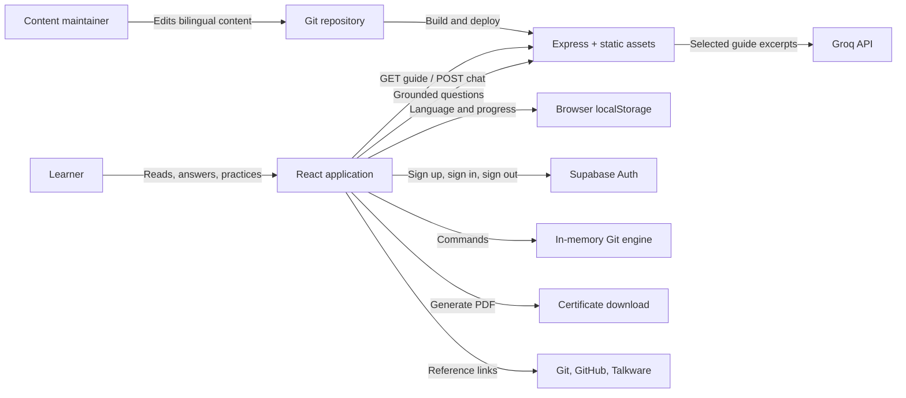
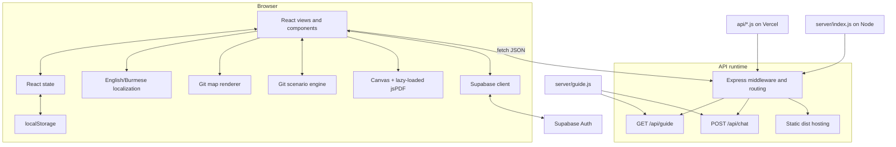
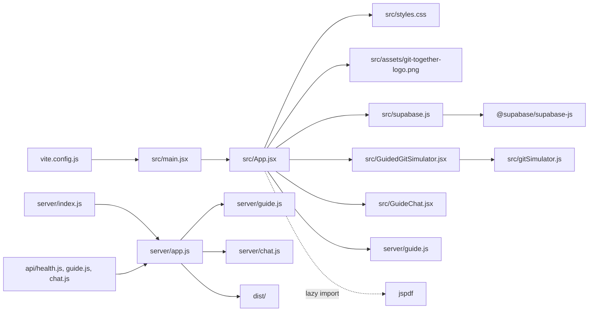
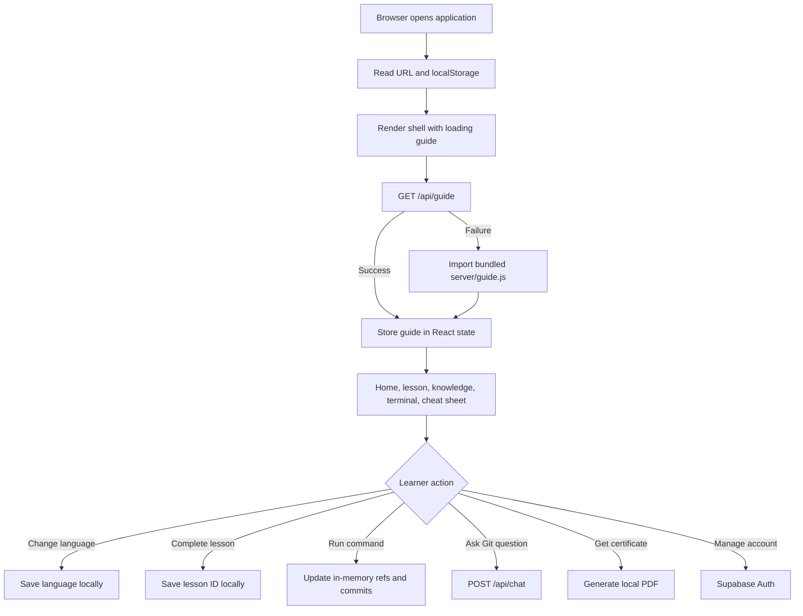
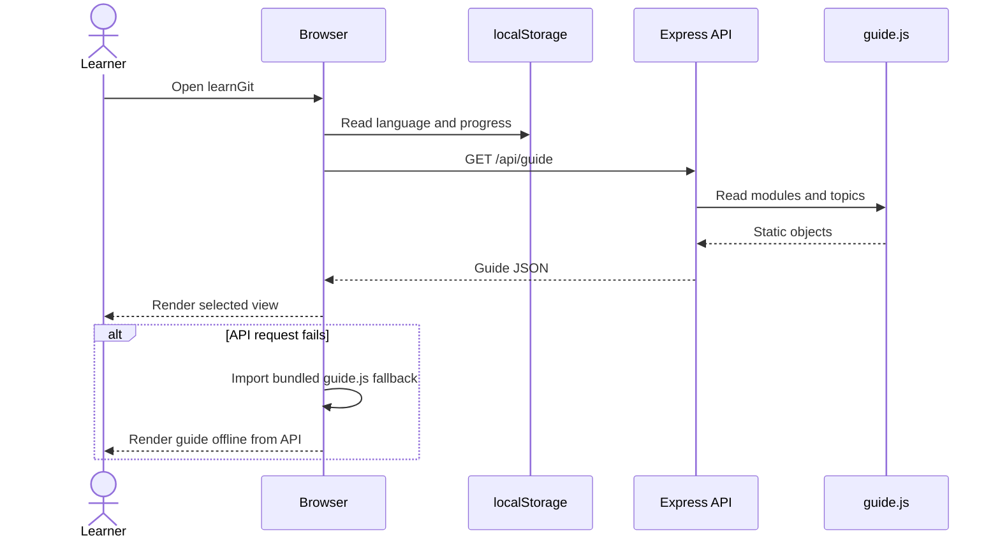
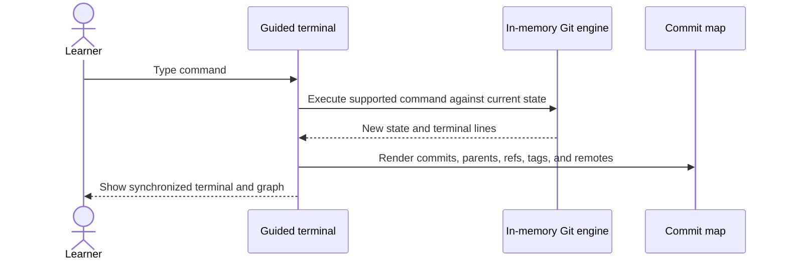
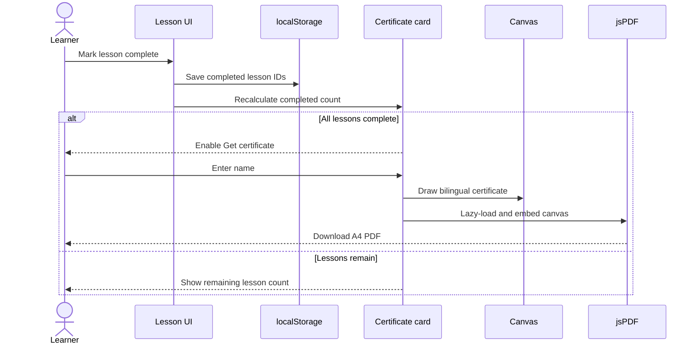
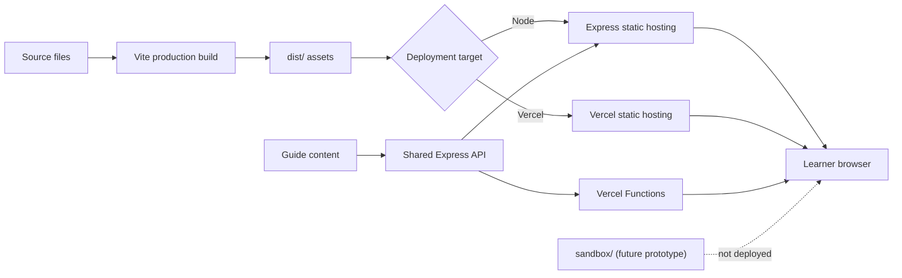

# Architecture

## 1. Architectural style

learnGit is a small client-server single-page application.

- The React client owns presentation, navigation, local progress, interaction state, and PDF output
- The Express server owns guide delivery, grounded AI requests, and production static hosting
- The browser owns an in-memory Git simulator; the real-sandbox prototype is not exposed
- Static JavaScript objects are the content store
- Browser `localStorage` stores learner progress; Supabase Auth manages optional account sessions

This keeps learning data local while allowing learners to use an optional account.

## 2. System context



## 3. Container view



## 4. Source dependencies



The supplied asset is presented as the learnGit brand mark in the header and footer.

## 5. Primary data flow



## 6. Data schemas

The application uses JavaScript objects rather than a database schema. The following definitions
describe the expected shapes.

### Guide response

```ts
type Guide = {
  name: string;
  description: string;
  modules: Module[];
  knowledgeTopics: KnowledgeTopic[];
};
```

### Module

```ts
type Module = {
  id: string;
  number: string;
  title: string;
  description: string;
  duration: string;
  difficulty: string;
  my: {
    title: string;
    description: string;
    duration: string;
    difficulty: string;
  };
  lessons: Lesson[];
};
```

### Lesson

```ts
type Lesson = {
  id: string;
  title: string;
  eyebrow: string;
  readTime: string;
  summary: string;
  points: Array<{
    title: string;
    copy: string;
  }>;
  command: string;
  commandLabel: string;
  tip: string;
  challenge?: string;
  check: QuickCheck;
  my: {
    title: string;
    eyebrow: string;
    readTime: string;
    summary: string;
    points: Array<{
      title: string;
      copy: string;
    }>;
    commandLabel: string;
    tip: string;
    check: QuickCheck;
  };
};
```

The command is language-independent and therefore stays at the lesson top level.

### Quick check

```ts
type QuickCheck = {
  question: string;
  options: string[];
  correct: number;
  success: string;
};
```

`correct` points to the source option. The client maps correctness onto each option before
shuffling the displayed order.

### Knowledge topic

```ts
type KnowledgeTopic = {
  id: string;
  category: string;
  question: string;
  answer: string;
  example: string;
  my: {
    category: string;
    question: string;
    answer: string;
    example: string;
  };
};
```

### AI chat exchange

```ts
type ChatRequest = {
  language: "en" | "my";
  messages: Array<{
    role: "user" | "assistant";
    content: string;
  }>;
};

type ChatResponse = {
  answer: string;
  sources: Array<{
    id: string;
    title: string;
    type: "lesson" | "knowledge";
  }>;
};
```

### Browser persistence

```ts
type StoredLanguage = "en" | "my";
type StoredProgress = string[];
```

## 7. Use cases

| Actor | Use case | Main result |
| --- | --- | --- |
| Learner | Browse learning modules | Sees ordered beginner lessons |
| Learner | Switch language | UI and content change to English or Burmese |
| Learner | Study a lesson | Reads concise content and sees a Git-map visualization |
| Learner | Answer a quick check | Gets immediate feedback with shuffled answer positions |
| Learner | Practice a command | Updates a synchronized, in-browser terminal and commit map |
| Learner | Ask a workflow question | Gets an answer grounded in selected learnGit excerpts |
| Learner | Track progress | Completion persists on the current browser |
| Learner | Download certificate | Gets a locally generated PDF after all lessons are complete |
| Contributor | Improve content | Edits bilingual static content and opens a pull request |
| Maintainer | Deploy a release | Builds the client and starts the Express service |

## 8. Sequence: application load



## 9. Sequence: terminal practice



No command is executed by the operating system or API runtime.

## 10. Sequence: lesson completion and certificate



## 11. Contributor workflow

```mermaid
flowchart LR
    Issue["Find or create issue"] --> Fork["Fork if needed"]
    Fork --> Branch["Create focused branch"]
    Branch --> Change["Change code, content, or docs"]
    Change --> Check["npm run check"]
    Check --> Build["npm run build"]
    Build --> Commit["Create clear commit"]
    Commit --> Push["Push branch"]
    Push --> PR["Open pull request"]
    PR --> Review["Review and revisions"]
    Review --> Merge["Merge to main"]
```



## 12. Runtime workflow



## 13. Architectural decisions

### Static content instead of a database

Benefits:

- Content changes are reviewed in Git
- No database operations or migrations
- Simple and inexpensive deployment

Tradeoff:

- Editors must change source code and redeploy

### Local progress alongside optional accounts

Benefits:

- No signup barrier for reading lessons
- Minimal privacy risk
- Learning progress remains independent from identity data

Tradeoff:

- Progress does not follow a learner to another browser or device, even after sign-in

### In-browser Git model

Benefits:

- Instant interaction with no service dependency
- Terminal output and commit map stay synchronized
- Commands cannot reach the learner device or application host

Tradeoff:

- The model supports educational workflows rather than every behavior of the Git executable

### Guide-grounded AI instead of open-ended chat

The server selects relevant documents from `server/guide.js` and provides only those excerpts to
Groq. Authentication, payload limits, and server-only credentials reduce abuse and secret exposure.

### Client-side certificate generation

Benefits:

- Names stay in the browser
- No file storage or certificate endpoint
- Works without an account

Tradeoff:

- Certificate issuance is based on browser-local progress and is not independently verifiable

### Focused interactive components

The primary views remain in `src/App.jsx`, while the terminal and AI helper are separate components
because they own independent connection lifecycles. Additional views can be extracted when feature
ownership or testing benefits from a smaller boundary.

## 14. Extension points

Future changes can add:

- Automated content-schema validation
- Component and API tests
- A service worker for full offline use
- More guided terminal exercises
- Verified certificates through an optional backend

Any extension should preserve the public no-login learning path unless the product scope explicitly
changes.
